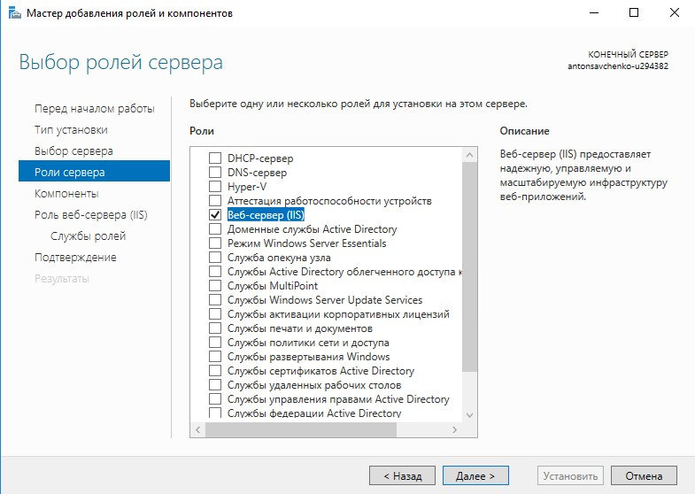
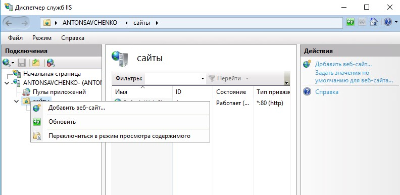

# Веб-сервис для ККТ Custom TK302-ФБ (TK302-FB Printer)

*Веб-сервис* предоставляет API для работы с аппаратом ККТ - ТК302-ФБ. Подробное описание устройства и сопутствующие материалы можно найти на [странице](https://ladon.ru/kontrolno-kassovaya-tekhnika-kkt/kkt-custom-tk302-fb-ispolnenie-2/) официального сайте российского представителя производителя. Взаимодействие с *веб-сервисом* осуществляется по протоколу HTTP, поддерживаемые HTTP-запросы перечислены ниже.


## Установка

Инструкция по установке на сервере Windows. Проверено на свежеустановленном **Windows Server 2016 Standart** (1607) x64. Параметры конфигурации: 2x2.2ГГц, 2Гб RAM, 30Гб HDD.

1. В *Диспетчере Серверов* добавить роль **"Веб-сервер (IIS)"**, при установке все настройки оставить по умолчанию.



2. Скачать и установить среду выполнения - [ASP.NET Core 3.1 Runtime](https://dotnet.microsoft.com/download/dotnet/thank-you/runtime-aspnetcore-3.1.21-windows-hosting-bundle-installer). После установки перезагрузить сервер.

3. Разместить разархивированную папку с *веб-сервисом* на сервере, например, по адресу `C:\inetpub\TK302FBPrinter`.

4. В *Диспетчере служб IIS* остановить созданный по умолчанию веб-сайт **"Default Web Site"** (кнопкой **"Остановить"** на правой панели) и создать новый веб-сайт. При создании указать настройки, как показано на скриншоте ниже. Запустить созданный веб-сайт.




## Проверка

1. Проверить работу *веб-сервиса*, открыв в браузере адрес `http://localhost/`. При этом должна появиться стартовая проверочная страница с текстом `TK302-FB Printer Service is running...`.

2. Проверить работу конкретных запросов к *веб-сервису* можно при помощи одной из утилит или полноценных программ для отправки HTTP-запросов, например, **telnet** или [Postman](https://www.postman.com).

3. Для проверки *веб-сервиса* в режиме эмуляции (то есть без необходимости подключения реального устройства - принтера) в файле `appsettings.json` указать значние `true` для параметра `EmulationMode`.

4. Для проверки конкретного запроса с помощью утилиты **telnet**, например, запроса для воспроизведения звукового сигнала, необходимо запустить командную строку (`cmd.exe`), установить утилиту **telnet** командой `dism /online /Enable-Feature /FeatureName:TelnetClient`, подключиться к *веб-сервису* командой `telnet localhost 80`, перейти в режим управления командой `Ctrl + ]`, включить режим отображения вводимых символов командой `set localecho`, выйти из режима управления, нажав клавишу `Enter`, указать первой строкой запроса `POST /api/beep HTTP/1.1`, второй строкой - `Host: localhost`, третьей строкой - `Content-length: 0`, четвертую строку оставить пустой. После введения последней четвертой строки запрос будет отправлен на сервер и на экране будет отображен ответ сервера. Успешный ответ будет обозначен статусом `200 ОК` и содержимым без ошибок работы принтера (`{"succeed":true,"errorDescription":""}`).

5. Для корректной работы приложения с реальным устройством установить на сервер [драйвер](https://ladon.ru/upload/iblock/fd6/custom_tk302_fb_driver_v.2.30.00.zip) (для проверки в режиме эмуляции драйвер не нужен).


## HTTP-Запросы


### Пустое содержимое запроса и стандартное содержимое ответа

В большинстве запросов содержимое запроса (Body) пустое.

Также в большинстве запросов в качестве содержимого ответа (Body) возвращается структура с полями `succeed` (`true` - запрос обработан без ошибок, `false` - запрос обработан с ошибкой) и `errorDescription` - содержит описание ошибки, если она произошла. Например:

```json
{
    "succeed": true,
    "errorDesription": ""
}
```

```json
{
    "succeed": false,
    "errorDesription": "ErrorCode: 5. ErrorDescription: Open connection failed. OperatorCode: -1"
}
```

### Издать звуковой сигнал

`POST /api/beep`

Пустое содержимое запроса, стандартное содержимое ответа.


### Получить статус ККТ

`GET /api/status`

Еще не реализован.


### Открыть смену

`POST /api/shift/open`

Пустое содержимое запроса, стандартное содержимое ответа.


### Закрыть смену

`POST /api/shift/close`

Пустое содержимое запроса, стандартное содержимое ответа.


### Напечатать чек

`POST /api/print/receipt`


#### Содержимое запроса

- `Tax` - система налогообложения. Обязательный параметр. Одно из возможных значений (*примечание: корректость соответствия русским названиям нужно уточнять у производителя ККТ*):

    - `AutomaticMode` - Автоматический выбор системы налогооблажения. *Примечание: как именно происходит выбор нужно уточнять у производителя ККТ*

    - `Traditional` - ОСН.

    - `LightIncome` - УСН, доходы.
    
    - `LightIncomeNoExpenses` - УСН, доходы минус расходы.

    - `SingleTax` - ЕСН.

    - `Agricultural` - ЕНВД.
    
    - `Patent` - Патент.

- `Items` - массив позиций в чеке. Обязательный параметр. Состоит из:

    - `Description` - наименование товара. Строка текста. До 250 символов. Обязательный параметр.

    - `Quantity` - количество товаров. Целое число. До 100 000. Обязательный параметр. Примечание: последние **три** знака обозначают десятичную часть, поэтому, например, 1 000 обозначает 1 штуку.

    - `Price` - цена за единицу товара. Целое число. До 10 000 000. Обязательный параметр. Примечание: последние **два** знака обозначают десятичную часть, поэтому, например, 1 050 обозначает 10 рублей 50 копеек.

    - `VAT` - Отдел НДС. Обязательный параметр. Одно из возможных значений:

        - `NoVAT` - Без НДС.

        - `Percent0` - 0%.

        - `Percent10` - 10%.

        - `Percent20` - 20%.

        - `Percent10Base110` - 10/110.

        - `Percent20Base120` - 20/120.

- `Total` - общая сумма чека. Целое число. До 10 000 000. Обязательный параметр. Примечание: последние **два** знака обозначают десятичную часть, поэтому, например, 1 050 обозначает 10 рублей 50 копеек.

Примеры:

```json
{
  "Tax": "Patent",
  "Items": [
    {
      "Description": "Товар 1",
      "Quantity": 1000,
      "Price": 100,
      "VAT": "Percent0"
    }
  ],
  "Total": 100
}
```

```json
{
  "Tax": "Patent",
  "Items": [
    {
      "Description": "Товар 1",
      "Quantity": 1500,
      "Price": 1000,
      "VAT": "Percent0"
    },
    {
      "Description": "Товар 2",
      "Quantity": 10000,
      "Price": 200,
      "VAT": "Percent0"
    }
  ],
  "Total": 3500
}
```


#### Содержимое ответа

Стандартное содержимое ответа.


### Напечатать чек возврата

`POST /api/print/receipt/return`

Еще не реализован.


### Напечатать слип-чек

`POST /api/print/slip`

Еще не реализован.


### Напечатать билет

`POST /api/print/ticket`

Еще не реализован.


### Напечатать x-отчет

`POST /api/print/report/x`

Еще не реализован.
