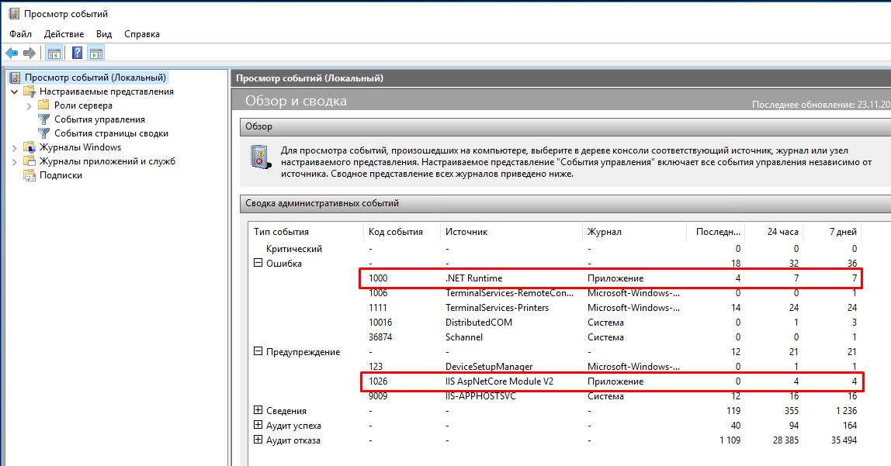

# Веб-сервис для ККТ Custom TK302-ФБ (TK302-FB Printer)

*Веб-сервис* предоставляет API для работы с аппаратом ККТ - ТК302-ФБ. Подробное описание устройства и сопутствующие материалы можно найти на [странице](https://ladon.ru/kontrolno-kassovaya-tekhnika-kkt/kkt-custom-tk302-fb-ispolnenie-2/) официального сайте российского представителя производителя. Взаимодействие с *веб-сервисом* осуществляется по протоколу HTTP, поддерживаемые HTTP-запросы перечислены ниже.


## Установка

Инструкция по установке на сервере Windows. Проверено на свежеустановленном **Windows Server 2016 Standart** (1607) x64. Параметры конфигурации: 2x2.2ГГц, 2Гб RAM, 30Гб HDD.

1. В *Диспетчере Серверов* добавить роль **"Веб-сервер (IIS)"**, при установке все настройки оставить по умолчанию.


2. Скачать и установить среду выполнения - [ASP.NET Core 3.1 Runtime](https://dotnet.microsoft.com/download/dotnet/thank-you/runtime-aspnetcore-3.1.21-windows-hosting-bundle-installer). После установки перезагрузить сервер.

3. Разместить разархивированную папку с *веб-сервисом* на сервере, например, по адресу `C:\inetpub\TK302FBPrinter`.

4. В *Диспетчере служб IIS* остановить созданный по умолчанию веб-сайт **"Default Web Site"** (кнопкой **"Остановить"** на правой панели) и создать новый веб-сайт. При создании указать настройки, как показано на скриншоте ниже. Запустить созданный веб-сайт.


## Проверка

1. Проверить работу *веб-сервиса*, открыв в браузере адрес `http://localhost/`. При этом должна появиться стартовая проверочная страница с текстом `TK302-FB Printer Service is running...`.

2. Проверить работу конкретных запросов к *веб-сервису* можно при помощи одной из утилит или полноценных программ для отправки HTTP-запросов, например, **telnet** или [Postman](https://www.postman.com).

3. Для проверки *веб-сервиса* в режиме эмуляции (то есть без необходимости подключения реального устройства - принтера) в файле `appsettings.json` указать значение `true` для параметра `EmulationMode` (см. описание секции настроек для устройства).

4. Для проверки конкретного запроса с помощью утилиты **telnet**, например, запроса для воспроизведения звукового сигнала, необходимо запустить командную строку (`cmd.exe`), установить утилиту **telnet** командой `dism /online /Enable-Feature /FeatureName:TelnetClient`, подключиться к *веб-сервису* командой `telnet localhost 80`, перейти в режим управления командой `Ctrl + ]`, включить режим отображения вводимых символов командой `set localecho`, выйти из режима управления, нажав клавишу `Enter`, указать первой строкой запроса `POST /api/beep HTTP/1.1`, второй строкой - `Host: localhost`, третьей строкой - `Content-length: 0`, четвертую строку оставить пустой. После введения последней четвертой строки запрос будет отправлен на сервер и на экране будет отображен ответ сервера. Успешный ответ будет обозначен статусом `200 ОК` и содержимым без ошибок работы принтера (`{"succeed":true,"errorDescription":""}`).

5. Для корректной работы приложения с реальным устройством установить на сервер [драйвер](https://ladon.ru/upload/iblock/fd6/custom_tk302_fb_driver_v.2.30.00.zip) (для проверки в режиме эмуляции драйвер не нужен).

6. А также указать корректный COM-порт в настройках *веб-сервиса* (см. описание секции настроек для устройства).


## Отладка

Получить информацию об ошибках во время работы *веб-сервиса* можно нижеследующими способами.

### **Windows Event Viewer** (**Просмотр событий**)

Увидеть ошибки и предупреждения можно как в разделе **Просмотр событий (Локальный) — Сводка административных событий**. Так и в разделе **Журналы Windows — Приложение**.




### Стандартные логи веб-сервера (по умолчанию выключены).

По умолчанию текстовые файлы с логами располагаются внутри папки с *веб-сервисом* по адресу `[TK302FBPrinter]\logs\`. Для того, чтобы включить данный вид логирования нужно в файле конфигурации *веб-сервиса* `[TK302FBPrinter]\web.config` изменить значение флага `stdoutLogEnabled` на `"true"`. А также добавить права веб-серверу **IIS** на запись в папке с *веб-сервисом*. Для этого необходимо в свойствах папки `[TK302FBPrinter]` на вкладке `Безопасность` добавить пользователя `IIS_IUSRS` и дать ему права `Полный доступ`.


## HTTP-Запросы


### HTTP-Заголовки

Для корректной отправки HTTP-запросов достаточно добавлять в них следующие HTTP-заголовки:

`Content-Type: application/json`


### Пустое содержимое запроса и стандартное содержимое ответа

В некоторых запросах содержимое запроса (Body) пустое.

Также в большинстве запросов в качестве содержимого ответа (Body) возвращается структура с полями `succeed` (`true` - запрос обработан без ошибок, `false` - запрос обработан с ошибкой) и `errorDescription` - содержит описание ошибки, если она произошла. Например:

```json
{
    "succeed": true,
    "errorDesription": ""
}
```

```json
{
    "succeed": false,
    "errorDesription": "DeviceError. ErrorCode: 5. ErrorDescription: Open connection failed. OperatorCode: -1"
}
```

### Издать звуковой сигнал

`POST /api/beep`

Пустое содержимое запроса, стандартное содержимое ответа.


### Получить статус ККТ

`GET /api/status`


#### Содержимое запроса

Пустое содержимое запроса.


#### Содержимое ответа

- `printerStatus` - структура, содержащая параметры принтера. Если при получения статуса принтера произошла ошибка, то значением будет `null`. Содержит следующие параметры (*примечание: более полное пояснение параметров нужно уточнять у производителя ККТ*):

    - `printerError` - ошибка принтера.

    - `coverOpen` - крышка открыта.
    
    - `paperPresent` - наличие бумаги.

    - `paperNearEnd` - бумага скоро закончится.

    - `cutterError` - ошибка отрезчика.

    - `shiftOpen` - смена открыта.

    - `dateNotSet` - дата не установлена.

    - `printing` - печать.

    - `resetNeeded` - требуется перезагрузка.

    - `paperJam` - замятие.

    - `printerIdle` - режим ожидания.

    - `fwUpadteWaiting` - ожидание обновления ПО.

    - `ticketOut` - чек в принтере.

    - `virtualPaperNearEnd` - виртуальный NPE.

    - `hwInitJumperOn` - режим инициализации.

    - `serialized` - регистрация.

  - `succeed` - аналогично `succeed` в стандартном содержимом ответа.

  - `errorDescription` - аналогично `errorDescription` в стандартном содержимом ответа.


Примеры:

```json
{
  "printerStatus": {
    "printerError": false,
    "coverOpen": false,
    "paperPresent": true,
    "paperNearEnd": true,
    "cutterError": false,
    "shiftOpen": false,
    "dateNotSet": false,
    "printing": false,
    "resetNeeded": false,
    "paperJam": false,
    "printerIdle": true,
    "fwUpadteWaiting": false,
    "ticketOut": false,
    "virtualPaperNearEnd": true,
    "hwInitJumperOn": false,
    "serialized": true
  },
  "succeed": true,
  "errorDescription": ""
}
```

```json
{
  "printerStatus": null,
  "succeed": false,
  "errorDescription": "DeviceError. ErrorCode: 5. ErrorDescription: Open connection failed. OperatorCode: -1"
}
```


### Открыть смену

`POST /api/shift/open`

#### Содержимое запроса

Содержимое запроса может быть пустым. В этом случае необходимо не забыть указать HTTP-заголовок `Content-Type: application/json`.

- `cut` - признак отрезания бумаги после печати. Необязательный параметр. Одно из значений: `true` или `false`. Если параметр не указан, то значением по умлочанию является `true`. Значене по умоляанию предполагает, что убрана автоотрезка в настройках принтера *(Custom-RU Test Tool -> Настройкт ККТ -> Параметры чека -> Автоотрезчик активирован)*.


#### Содержимое ответа

Стандартное содержимое ответа.


### Закрыть смену

`POST /api/shift/close`

#### Содержимое запроса

Содержимое запроса может быть пустым. В этом случае необходимо не забыть указать HTTP-заголовок `Content-Type: application/json`.

- `cut` - признак отрезания бумаги после печати. Необязательный параметр. Одно из значений: `true` или `false`. Если параметр не указан, то значением по умлочанию является `true`. Значене по умоляанию предполагает, что убрана автоотрезка в настройках принтера *(Custom-RU Test Tool -> Настройкт ККТ -> Параметры чека -> Автоотрезчик активирован)*.


#### Содержимое ответа

Стандартное содержимое ответа.


### Напечатать x-отчет

`POST /api/print/report/x`

#### Содержимое запроса

Содержимое запроса может быть пустым. В этом случае необходимо не забыть указать HTTP-заголовок `Content-Type: application/json`.

- `cut` - признак отрезания бумаги после печати. Необязательный параметр. Одно из значений: `true` или `false`. Если параметр не указан, то значением по умлочанию является `true`. Значене по умоляанию предполагает, что убрана автоотрезка в настройках принтера *(Custom-RU Test Tool -> Настройкт ККТ -> Параметры чека -> Автоотрезчик активирован)*.


#### Содержимое ответа

Стандартное содержимое ответа.


### Напечатать чек

`POST /api/print/receipt`


#### Содержимое запроса

- `tax` - система налогообложения. Обязательный параметр. Одно из возможных значений (*примечание: корректость соответствия русским названиям нужно уточнять у производителя ККТ*):

    - `AutomaticMode` - Автоматический выбор системы налогооблажения. *Примечание: как именно происходит выбор нужно уточнять у производителя ККТ*

    - `Traditional` - ОСН.

    - `LightIncome` - УСН, доходы.
    
    - `LightIncomeNoExpenses` - УСН, доходы минус расходы.

    - `SingleTax` - ЕСН.

    - `Agricultural` - ЕНВД.
    
    - `Patent` - Патент.

- `items` - массив позиций в чеке. Обязательный параметр. Состоит из:

    - `description` - наименование товара. Строка текста. До 250 символов. Обязательный параметр.

    - `quantity` - количество товаров. Целое число. До 100 000. Обязательный параметр. Последние **три** знака обозначают десятичную часть, поэтому, например, 1 000 обозначает 1 штуку.

    - `price` - цена за единицу товара. Целое число. До 10 000 000. Обязательный параметр. Последние **два** знака обозначают десятичную часть, поэтому, например, 1 050 обозначает 10 рублей 50 копеек.

    - `vat` - Отдел НДС. Обязательный параметр. Одно из возможных значений:

        - `NoVAT` - Без НДС.

        - `Percent0` - 0%.

        - `Percent10` - 10%.

        - `Percent20` - 20%.

        - `Percent10Base110` - 10/110.

        - `Percent20Base120` - 20/120.

- `supplier` - данные поставщика для передачи в ОФД вместе с признаком агента по предмету расчета. Необязательный параметр. Состоит из:

    - `inn` - ИНН поставщика. Строка текста. До 250 символов. Обязательный параметр.

    - `companyName` - наименование поставщика. Строка текста. До 250 символов. Обязательный параметр.

    - `phone` - телефон поставщика. Строка текста. До 250 символов. Обязательный параметр.

- `isReturn` - признак чека возврата. Необязательный параметр. Одно из значений: `true` или `false`. Если параметр не указан, то значением по умлочанию является `false`.

- `cut` - признак отрезания бумаги после печати. Необязательный параметр. Одно из значений: `true` или `false`. Если параметр не указан, то значением по умлочанию является `true`. Значене по умоляанию предполагает, что убрана автоотрезка в настройках принтера *(Custom-RU Test Tool -> Настройкт ККТ -> Параметры чека -> Автоотрезчик активирован)*.

- `total` - общая сумма чека. Целое число. До 10 000 000. Обязательный параметр. Последние **два** знака обозначают десятичную часть, поэтому, например, 1 050 обозначает 10 рублей 50 копеек.

Примеры:

```json
{
  "tax": "Patent",
  "items": [
    {
      "description": "Товар 1",
      "quantity": 1000,
      "price": 100,
      "vat": "Percent0"
    }
  ],
  "total": 100
}
```

```json
{
  "tax": "Patent",
  "items": [
    {
      "description": "Товар 1",
      "quantity": 1000,
      "price": 100,
      "vat": "Percent0"
    }
  ],
  "isReturn": true,
  "total": 100
}
```

```json
{
  "tax": "Patent",
  "items": [
    {
      "description": "Товар 1",
      "quantity": 1500,
      "price": 1000,
      "vat": "Percent0"
    },
    {
      "description": "Товар 2",
      "quantity": 10000,
      "price": 200,
      "vat": "Percent0"
    }
  ],
  "total": 3500
}
```

```json
{
  "tax": "Patent",
  "items": [
    {
      "description": "Товар 1",
      "quantity": 1000,
      "price": 100,
      "vat": "Percent0"
    }
  ],
  "supplier": {
    "inn": "2222222223",
    "companyName": "ООО \"Ромашка\"",
    "phone": "+79001002030"
  },
  "total": 100
}
```

#### Содержимое ответа

Стандартное содержимое ответа.


### Напечатать слип-чек

`POST /api/print/slip`


#### Содержимое запроса


- `text` - текст для печати. Строка текста. До 1 000 символов. Обязательный параметр. Примерчание: внутри строки могут быть указаны разделители, которые будут заменены на переносы строк перед печатью (см. описание секции настроек для слип-чека).

- `cut` - признак отрезания бумаги после печати. Необязательный параметр. Одно из значений: `true` или `false`. Если параметр не указан, то значением по умлочанию является `true`. Значене по умоляанию предполагает, что убрана автоотрезка в настройках принтера *(Custom-RU Test Tool -> Настройкт ККТ -> Параметры чека -> Автоотрезчик активирован)*.

Пример:

```json
{
  "text": "Я помню чудное мгновенье:\nПередо мной явилась ты,/nКак мимолетное виденье,\n\n\nКак гений\n\n\n          чистой\n\n/n                 красоты."
}
```


#### Содержимое ответа

Стандартное содержимое ответа.


### Напечатать билет

`POST /api/print/ticket`


#### Содержимое запроса


- `templateName` - название шаблона. Строка текста. До 250 символов. Обязательный параметр. Шаблон определяется внешний вид билета (см. описание секции настроек для билета).

- `cut` - признак отрезания бумаги после печати. Необязательный параметр. Одно из значений: `true` или `false`. Если параметр не указан, то значением по умлочанию является `true`. Значене по умоляанию предполагает, что убрана автоотрезка в настройках принтера *(Custom-RU Test Tool -> Настройкт ККТ -> Параметры чека -> Автоотрезчик активирован)*.

- `placeholders` - служебные слова, использованные в шаблоне билета, и значения, которыми они должны быть заменены (см. описание секции настроек для билета). Состоит из:

  - `key` - служебное слово. Строка текста. До 250 символов. Обязательный параметр.

  - `value` - значение для замены. Строка текста. До 250 символов. Обязательный параметр.

- `seats` - места, которые будут напечатаны на билете. Формат печати мест на билете определяется настройками (см. описание секции настроек для билета). Состоит из:

  - `row` - ряд. Целое число. До 100. Обязательный параметр.

  - `place` - место. Целое число. До 1 000. Обязательный параметр.

Примеры:

```json
{
  "templateName": "Template1",
  "placeholders": [
    {
      "key": "[THEATRE]",
      "value": "Черёмушки"
    },
    {
      "key": "[COMPANY_NAME]",
      "value": "ООО \"Синема\""
    }
  ]
}
```

```json
{
  "templateName": "Template1",
  "placeholders": [
    {
      "key": "[THEATRE]",
      "value": "Черёмушки"
    },
    {
      "key": "[COMPANY_NAME]",
      "value": "ООО \"Синема\""
    }
  ],
  "seats": [
    {
      "row": 52,
      "place": 13
    },
    {
      "row": 52,
      "place": 14
    },
    {
      "row": 52,
      "place": 15
    },
    {
      "row": 52,
      "place": 16
    },
    {
      "row": 52,
      "place": 17
    },
    {
      "row": 52,
      "place": 18
    },
    {
      "row": 52,
      "place": 19
    }
  ]
}
```


#### Содержимое ответа

Стандартное содержимое ответа.


### Напечатать составной документ (слип-чек, билет и чек)

`POST /api/print/complex-doc`

Для коррекстной отрезки данного документа нужно убрать автоотрезку в настройках принтера *(Custom-RU Test Tool -> Настройкт ККТ -> Параметры чека -> Автоотрезчик активирован)*.


#### Содержимое запроса и ответа

Содержимое запроса и содержимое ответа предоставлены заказчиком по [данной ссылке](https://www.notion.so/V2-b4db6fd4b3c54d73b06e6db6c00b06c5#e3c0b62e6bec47bba44051f4fcf7f7a8). Ниже приведена копия этого описания.


##### Параметры запроса

Поле | Тип | Обязательно | Комментарий
-----|-----|-------------|------------
reprint | bool | Нет | Флаг повторной печати. По умолчанию false
slip_check | string | Нет | Слип-чек оплаты. Если null, слип-чек не будет включён в единый чек
tickets | object | Нет | Обьект, содержащий информацию для печати билетов. Если null, билеты не будут включены в единый чек
goods | object | Нет | Обьект, содержащий информацию для печати товарного чека. Если null, товарный чек не будет включён в единый чек


##### Параметры запроса для обьекта goods

Поле | Тип | Обязательно | Комментарий
-----|-----|-------------|------------
refund | bool | Да | Является ли чек возвратный. True - да, false - товарный чек
agent | bool | Да | Является ли держатель агентом
amount | integer | Да | Общая сумма покупки в копейках
items | array<item> | Да | Купленные товары в киоске
nds | string | Нет | НДС в процентах. Null, если НДС нет
agent_name | string | Нет | Название агента. Обязательно, если agent: true
agent_phone | string | Нет | Телефон агента. Обязательно, если agent: true
inn | string | Нет | ИНН агента. Обязательно, если agent: true
tax | string | Нет | Налогообложение. Обязательно, если agent: true
comment | string | Нет | Комментарий, любой текст


##### Параметры запроса для обьекта tickets

Поле | Тип | Обязательно | Комментарий
-----|-----|-------------|------------
theater_name | string | Да | Название кинотеатра
theater_legal_name | string | Да | Юридическое название кинотеатра
ogrn | string | Да | ОГРН – основной государственный регистрационный номер, который автоматически присваивается юридическим лицам. Состоит из 13 цифр.
inn | string | Да | ИНН
legal_address | string | Да | Юридический адрес
movie | string | Да | Название фильма
format | enum[string] [2D, 3D, IMAX 2D, IMAX 3D] | Да | Формат фильма
license | string | Да | Идентификатор лицензии фильма
age | enum[string] [0+, 6+, 12+, 16+, 18+] | Да | Возрастное ограничение
show_date | datetime [dd.mm.yy hh:mm] | Да | Дата проведения сеанса
hall | string | Да | Зал для проведения сеанса
amount | integer | Да | Цена за билет в копейках
print_code | string | Да | Принт-код билета
payment_type | enum[string] [card, bonus, pushkin-card] | Да | Способ оплаты
cashier | string | Да | ФИО кассира
payment_date | datetime [dd.mm.yy hh:mm] | Да | Дата покупки билета
seats | array<seat> | Да | Массив купленных мест
order_id | string | Да | ID заказа
amount | integer | Да | Сумма заказа в копейках
agent | bool | Да | Режим агента
viewers_count | integer | Да | Количество зрителей текущей покупки. Количество зрителей = количество билетов sofa * 2 + количество остальных билетой
bonus_card | string | Нет | Номер бонусной карты пользователя
bonus_type | enum[string] [pay, accrual] | Нет | Тип операции с бонусной картой: оплата бонусами, начисление бонусов
discount | integer | Нет | Сумма скидки в копейках
certificate | string | Нет | Идентификатор подарочного сертификата
tax | string | Нет | Налогообложение
comment | string | Нет | Комментарий
email | string | Нет | Email пользователя карты Иллюзион Бонус. Если она не была применена, значение поля null
agent_name | string | Нет | Название агента. Обязательно, если agent: true
agent_phone | string | Нет | Телефон агента. Обязательно, если agent: true


##### Параметры запроса для обьектов item (в goods)

Поле | Тип | Обязательно | Комментарий
-----|-----|-------------|------------
name | string | Да | Наименование товара
count | integer | Да | Количество товаров. Необходимо умножить на 1000
price | integer | Да | Цена за один товар в копейках


##### Параметры запроса для обьектов seat (в tickets)

Поле | Тип | Обязательно | Комментарий
-----|-----|-------------|------------
row | integer | Да | Ряд
place | integer | Да | Место
price | integer | Да | Цена билета в копейках
type | enum[string] [VIP, Диван, Партер, BeatBox] | Да | Тип места: 1. VIP → vip 2. Диван → sofa 3. Партер → simple 4. BeatBox → beatbox
ticket_number | string | Да | Номер билета


##### Параметры ответа

Поле | Тип | Обязательно | Комментарий
-----|-----|-------------|------------
status | enum[string] [success, error] | Да | Статус ответа


Примеры:

```json
{
  "operation_id": "123abc",
  "reprint": false,
  "slip_check": "Я помню чудное мгновенье:/nПередо мной явилась ты,\nКак мимолетное виденье,/n/n/nКак гений/n/n/n          чистой/n/n/n                 красоты.",
  "goods": {
    "refund": false,
    "agent": true,
    "inn": "2222222223",
    "agent_name": "ИП Хлапова А.А.",
    "agent_phone": "+71111111111",
    "items": [
      {
        "name": "Попкорн",
        "count": 1000,
        "price": 500
      },
      {
        "name": "Кинобилет",
        "count": 1000,
        "price": 1000
      },
      {
        "name": "Кола",
        "count": 2000,
        "price": 200
      },
      {
        "name": "Жвачка",
        "count": 3000,
        "price": 100
      },
      {
        "name": "Кинобилет",
        "count": 1000,
        "price": 2000
      }
    ],
    "amount": 1200,
    "tax": "patent",
    "nds": 0,
    "comment": "Комментарий"
  },
  "tickets": {
    "viewers_count": 3,
    "agent": true,
    "agent_name": "ИП Хлапова А.А.",
    "agent_phone": "+71111111111",
    "theater_name": "Кинотеатр КИНО",
    "theater_legal_name": "АО \"Фильм Фильм Фильм\"",
    "ogrn": "1027739050646",
    "inn": "7705353706",
    "legal_address": "125212, г. Москва, 1-ый Грайвороносовский пр-д, д. 20, с. 36",
    "movie": "Фантастические твари: Преступления Грин-де-Вальда",
    "format": "2D",
    "license": "121025518",
    "age": "12+",
    "show_date": "15.11.2021 17:05",
    "hall": "8",
    "amount": 3000,
    "discount": 200,
    "print_code": "12345678",
    "certificate": "456efg",
    "bonus_card": "789hij",
    "bonus_type": "accrual",
    "payment_type": "card",
    "cashier": "Иванов Иван Иванович",
    "payment_date": "14.11.2021 16:00",
    "tax": "patent",
    "comment": "456nop",
    "email": "789qrs@tuv.com",
    "order_id": "123qrs",
    "nds": 0,
    "seats": [
      {
        "row": 2,
        "place": 3,
        "type": "simple",
        "price": 1000,
        "ticket_number": "123wxy"
      },
      {
        "row": 2,
        "place": 42,
        "type": "sofa",
        "price": 2000,
        "ticket_numbet": "456zab"
      }
    ]
  }
}
```


## Настройки

В папке с *веб-сервисом* находится текстовый файл `appsettings.json`. Файл составлен в формате JSON. Внутри этого файла перечислены различные настройки, которые подробнее описаны ниже.

Для того, чтобы изменные настройки прочитались *веб-сервисом*, необходимо перезапустить сайт в **IIS**.


### Секция `device` — настройки для устройства

- `emulationMode` - признак работы принтера в режиме эмуляции, то есть без подключения физического устройства (принтера). Этот режим может быть полезен, например, для проверки работы *веб-сервиса* и отладки связи с ним другого ПО. Одно из значений: `true` или `false`.

Пример:

```json
"emulationMode": false
```

- `portName` - COM-порт, к которому подключен принтер. Например, `COM1`, `COM2` и т.д. Для создания виртуального порта можно использовать утилиту **Custom-RU Test Tool**. Строка текста.

Пример:

```json
"portName": "COM5"
```

- `operatorPassword` - пароль оператора принтера. Строка текста.

Пример:

```json
"operatorPassword": "999999"
```


### Секция `slip` — настройки печати слип-чека

- `lineSeparators` - разделители строк в слип-чеке, каждый из которых должен быть заменен на перенос строки перед печатью переданного текста в слип-чеке (см. описание HTTP-запроса печати слип-чека). Массив строк текста.

Пример:

```json
"lineSeparators": ["\n", "/n"]
```


### Секция `ticket` - настройки печати билета

- `seatsPlaceholder` - служебное слово, которое будет использовано в наборе строк с местами для обозначения одного текста с местом (пара ряд - место). Причем подразумевается, что симол единицы в этом служебном слове будет менятся на соответствующий порядковый номер по мере указания мест в наборе. Строка текста.

  Пример:

  ```json
  "seatsPlaceholder": "[SEATS1]"
  ```

- `seatsSeparator` - разделитель, который будет установлен между текстов с местами в наборе строк с местами. Строка текста.

  Пример:

  ```json
  "seatsSeparator": ","
  ```

- `seatsName` - текст, который будет использован в наборе строк с местами для обозначения одого текста с местом. Строка текста.

  Пример:

  ```json
  "seatsName": "ряд [ROW] место [PLACE]"
  ```

- `seatsRowPlaceholder` - служебное слово, которое будет обозначать ряд в тексте для места. Строка текста.

  Пример:

  ```json
  "seatsRowPlaceholder": "[ROW]"
  ```

- `seatsPlacePlaceholder` - служебное слово, которое будет обозначать место в тексте для места. Строка текста.

  Пример:

  ```json
  "seatsPlacePlaceholder": "[PLACE]"
  ```

- `templates` - шаблоны для оформления билета (см. описание HTTP-запроса печати билета). Состоит из:

  - `templateName` - название шаблона. Должно быть уникальным для идентификации шаблона. Строка текста.

    Пример:
    
    ```json
    "templateName": "Template1"
    ```

  - `sizeX` - размер билета поперек печатной ленты. Целое число.

    Пример:
    
    ```json
    "sizeX": 576
    ```

  - `sizeY` - размер билета вдоль печатной ленты. Целое число.

    Пример:
    
    ```json
    "sizeY": 1100
    ```

  - `lines` - набор линий (и рамок), которые должны быть напечатаны на билете. Состоит из:

    - `positionX1` - расположение левого верхнего угла элемента поперек печатной ленты. Целое число.

      Пример:
      
      ```json
      "positionX1": 25
      ```

    - `positionY1` - расположение левого верхнего угла элемента вдоль печатной ленты. Целое число.

      Пример:
      
      ```json
      "positionY1": 25
      ```

    - `positionX2` - расположение правого нижнего угла элемента поперек печатной ленты. Целое число.

      Пример:
      
      ```json
      "positionX2": 575
      ```

    - `positionY2` - расположение правого нижнего угла элемента вдоль печатной ленты. Целое число.

      Пример:
      
      ```json
      "positionY2": 1050
      ```

    - `width` - толщина линий. Целое число.

      Пример:
      
      ```json
      "width": 3
      ```

  - `textLines` - набор тестовых строк, которые должны быть напечатаны на билете. Состоит из:

    - `text` - текст, в котором могут быть использованы служебные слова. Переданные в HTTP-запросе печати билета служебные слова будут найдены в тексте и заменены на соответсвтующие переданные значения.

      Пример:

      ```json
      "text": "Кинотеатр [THEATRE]",
      ```

    - `rotation` - поворот элемента. Целое число.

      Пример:

      ```json
      "rotation": 2,
      ```

    - `positionX` - расположение левого верхнего угла элемента поперек печатной ленты. Целое число.

      Пример:

      ```json
      "positionX": 475,
      ```

    - `positionY` - расположение левого верхнего угла элемента вдоль печатной ленты. Целое число.

      Пример:

      ```json
      "positionY": 150,
      ```

    - `fontSize` - размер шрифта. Целое число.

      Пример:

      ```json
      "fontSize": 3,
      ```

    - `scaleX` - масштаб (увеличение размера) элемента поперек печатной ленты. Целое число.

      Пример:

      ```json
      "scaleX": 2,
      ```

    - `scaleY` - масштаб (увеличение размера) элемента вдоль печатной ленты. Целое число.

      Пример:

      ```json
      "scaleY": 2,
      ```

    - `fontStyle` - стиль текста. Целое число.

      Пример:

      ```json
      "fontStyle": 11
      ```

  - `seatTextLines` - набор строк с местами, которые должны быть напечатаны на билете. Сколько в данном наборе будет указано строк - столько и будет напечатано на билете, при условии, что в HTTP-запросе на печать билета будет передано достаточно мест. Если мест будет передано не достаточно для каких-то строк, то они не будут напечатаны. Если мест будет передано больше, чем указано служебных слов с индексами внутри данных строк, то лишние места не будут напечатаны. Состоит из:

    - `text` - текстовая строка, которая содержит места. Внутри строки должны быть указаны служебные слова с индексами, которые будут заменены на тексты с рядом и местом, а также в конец промежуточных ключевых слов будут добавлены разделители (см. описание других полей в этом разделе для настройки формата текстов с рядом и местом).
    
      Пример:

      ```json
      "text": "[SEATS1] [SEATS2]"
      ```

    - `rotation` - поворот элемента. Целое число.
    
      Пример:

      ```json
      "rotation": 2
      ```

    - `positionX` - расположение левого верхнего угла элемента поперек печатной ленты. Целое число.
    
      Пример:

      ```json
      "positionX": 230
      ```

    - `positionY` - расположение левого верхнего угла элемента вдоль печатной ленты. Целое число.
    
      Пример:

      ```json
      "positionY": 150
      ```

    - `fontSize` - размер шрифта. Целое число.
    
      Пример:

      ```json
      "fontSize": 3
      ```

    - `scaleX` - масштаб (увеличение размера) элемента поперек печатной ленты. Целое число.
    
      Пример:

      ```json
      "scaleX": 2
      ```

    - `scaleY` - масштаб (увеличение размера) элемента вдоль печатной ленты. Целое число.
    
      Пример:

      ```json
      "scaleY": 1
      ```

    - `fontStyle` - стиль текста. Целое число.
    
      Пример:

      ```json
      "fontStyle": 1
      ```

  - `qrCodes` - набор QR-кодов, которые должны быть напечатаны на билете. Состоит из:

    - `text` - значение зашифрованное в QR-коде. Строка текста, в которой могут быть использованы служебные слова. Переданные в HTTP-запросе печати билета служебные слова будут найдены в тексте и заменены на соответсвтующие переданные значения.

      Пример:

      ```json
      "text": "12345[PRINT_CODE]67890",
      ```

    - `rotation` - поворот элемента. Целое число.

      Пример:

      ```json
      "rotation": 2,
      ```

    - `positionX` - расположение левого верхнего угла элемента поперек печатной ленты. Целое число.

      Пример:

      ```json
      "positionX": 75,
      ```

    - `positionY` - расположение левого верхнего угла элемента вдоль печатной ленты. Целое число.

      Пример:

      ```json
      "positionY": 800,
      ```

    - `scale` - масштаб (увеличение размера) элемента. Целое число.

      Пример:

      ```json
      "scale": 6
      ```

  - `bitmaps` - набор изображений, которые должны быть напечатаны на билете. Состоит из:

    - `bitmapId` - индекс изображения, предварительно загруженного в принтер. Загружаются изображения через утилиту **Custom-RU Test Tool**. Всего можно загрузить 25 изображений. Целое число.

      Пример:

      ```json
      "bitmapId": 1,
      ```

    - `rotation` - поворот элемента. Целое число.

      Пример:

      ```json
      "rotation": 2,
      ```

    - `positionX` - расположение левого верхнего угла элемента поперек печатной ленты. Целое число.

      Пример:

      ```json
      "positionX": 375,
      ```

    - `positionY` - расположение левого верхнего угла элемента вдоль печатной ленты. Целое число.

      Пример:

      ```json
      "positionY": 825,
      ```

    - `scaleX` - масштаб (увеличение размера) элемента поперек печатной ленты. Целое число.

      Пример:

      ```json
      "scaleX": 2,
      ```

    - `scaleY` - масштаб (увеличение размера) элемента вдоль печатной ленты. Целое число.

      Пример:

      ```json
      "scaleY": 2
      ```
